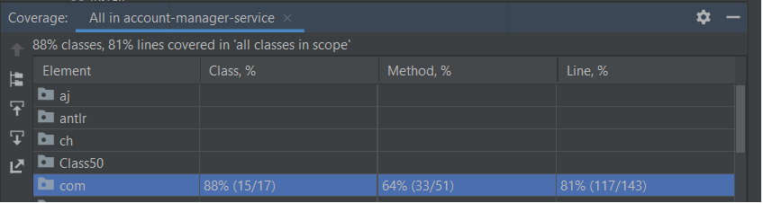

# Account Manager
This application include following stories:

1) As a customer I would like to get the balance of my account

2) As a customer I would like to be able to transfer an amount in HKD from one account to another account

## Table of contents
* [General info](#general-info)
* [Assmuptions](#assumptions)
* [Technologies](#technologies)
* [Setup](#setup)
* [Code coverage](#code-coverage)

## General info
The program will ask to enter appropriate allowed commands as below :

* Create a new canvas
* Start drawing on the canvas by issuing various commands.
* Quit

| Method  | API Endpoint  | Description |
| --------|-------------|---------------|
| GET   | /accounts/{accountNumber} | This API provide the Account Details of the provided accountNumber. |
| POST | /transaction/banktransfer/{accountNumber}| This API can be used to perform Bank Transfer transaction. |

## Assumptions

* Name of the company is acmebank, and the name of the service you are implementing is account-manager (use those names for your packages)
* Those accounts already exists: 12345678, and 88888888. Each of them have an initial balance of 1,000,000 HKD
* As a customer I should be able to get balance of those accounts, and transfer money between those accounts
* All amounts are in HKD
## Technologies
Project is created with:
* Java 11
* Maven

Below maven dependency used:
- Junit (used for unit and integration testing)
- H2 database used as a runtime.
- Spring Webflux is used for Springboot API development.
- Surefire to run the JUnit testcases.
## Setup
To run the project locally using maven:
5
###Prerequisites
* Maven
* JDK 11

###Please follow below steps to run the project through maven locally:

1 Run below maven command from source directory to create jar file
```
$ mvn clean install
```
2 Run below command to locate the generated jar file.
```
$ cd target/
```
3 Application will start and display the empty message. And ask Player 1 to throw the red disc in column (1-7).

4 Please make sure using appropriate endpoints.
```
1. GET - http://localhost:8080/accounts/88888888
Response : 
   {
    "accountNumber": 88888888,
    "accountBalance": 1000000.0,
    "currency": "HKD"
    }
2. POST - http://localhost:8080/transaction/banktransfer/88888888
Request Body :
{
    "toAccountNumber" : 12345678,
    "transferAmount" : 40000.0
}

Response:
{
    "accountNumber": 88888888,
    "accountBalance": 960000.0,
    "currency": "HKD"
}
Invalid command, This command is not supported by this application

Please Enter Paint Command:
```

##Code coverage
We are following TDD approach for development, Below screenshot help to understand the test coverage of code.



Test Case result of Surefire report:
```
[INFO] Results:
[INFO]
[INFO] Tests run: 13, Failures: 0, Errors: 0, Skipped: 0
[INFO]
```
Note: I wrote the Unit test cases for the required classes only.
